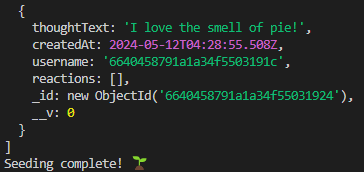
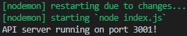

# social-lite

[](https://opensource.org/licenses/MIT)

Social-Lite is an innovative NoSQL-based social media API template designed to provide developers with a robust and scalable foundation for managing complex social interactions within their applications. This template excels in handling large volumes of unstructured data such as user profiles, friendships, posts, comments, and reactions, making it ideal for projects that demand high flexibility and speed. Its API-first design facilitates seamless integration with various front-end frameworks and mobile platforms, allowing developers to focus on creating unique user experiences without the complexities of backend data management. Key features include comprehensive user management, support for real-time interactions through comments and reactions, and a dynamic friendship mechanism to manage connections and friend requests. Social-Lite is the perfect starting point for building custom social media platforms or enhancing existing applications with social networking capabilities, backed by extensive documentation and developer support to ensure smooth implementation.

## Table of Contents
- [Prerequisites](#prerequisites)
- [Installation](#installation)
- [Usage](#usage)
- [Preview](#usage)
- [Questions](#questions)
- [License](#license)

## Prerequisites

> **_NOTE:_**
> This package requires you already have Node.js, npm, and MongoDB installed. If you need to download Node.js, [click here](https://nodejs.org/en/download) and follow their installation steps. This also goes for MongoDB Community Edition, which you are able to download from [this link](https://www.mongodb.com/try/download/community). Then come back to this repo and proceed with our installation steps.

## Installation

1. Open your terminal and clone the github repo:

```
git clone https://github.com/hokage-216/social-lite.git
```

2. 'cd' into the folder:

```
cd social-lite
```

3. Then run this command to install the required packages:

```
npm install
```

## Usage

After installing required packages, you will need to seed your mongoDB database with the following command:

```
npm run seed
```



Once you the confirm the seeding process has finished succusfully, you are able to start the application:

```
npm run dev
```

You should see in your terminal that a new server has been started.



## Preview

Click the image below to view a live demonstation & walkthrough.

<!-- [](https://youtu.be/GTsW5hLtMfo) -->

## Questions

If you have any questions about the repo, open an issue or contact me directly at berrylevente@hotmail.com.

To view more of my work [click here](https://github.com/hokage-216/).

## License

Copyright (c) 2024 LeVente Berry Jr.

Licensed under the MIT license. To view the license terms [click here](https://opensource.org/licenses/MIT).
